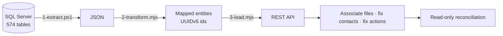

# CRM migration · 18 GB legacy SQL Server → REST-only SaaS CRM

**Role:** sole engineer, from research to production run, repairs and handover (Jun – Sep 2026)

A UK recruitment agency moved from a legacy CRM (a SQL Server backup: ~18 GB restored, 574 tables, **no declared primary or foreign keys**) to a SaaS recruitment CRM that could only be written through its public REST API. Rule: represent everything exactly as in the source, invent nothing.

## Pipeline

## Results on the live account
| Entity | Loaded |
|---|---|
| Companies | 7,611 / 7,611 |
| People | 36,661 / 36,661 |
| Activities with original dates | 253,541 |
| Contact → company links | 21,375 |
| File associations | 170,834 |
| Post-migration repair: hiring managers | 1,901 / 1,901 re-linked, 0 failed |
| Post-migration repair: activities | 49,725 restored, **99.97% content-exact**, 0 duplicates |

## Engineering decisions
- **Idempotent by design:** deterministic UUIDv5 ids salted per account, adopt-on-duplicate, checkpoints, and a refusal to run against the wrong account.
- **Batch-split retry:** when a batch hit a duplicate, isolate the single bad record and retry the rest. That's the difference between hours and days.
- **Safety rails:** 50-record canary gates, a drops ledger that fails the run, self-halting on anomalous duplicates, and a watchdog for unattended overnight runs.
- **Found a platform bug:** concurrent POSTs created "ghost" rows (id reserved, record invisible). I diagnosed it, switched to sequential loading and re-salted ids.
- **Integrity audit without keys:** proved 71 inferred ID/FK columns across 12 tables by joins and found 3 broken-reference cases (~400 orphan rows) before they reached the client.
- **Mapped undocumented API limits** (batch caps, which endpoints honour historical dates, uniqueness rules that include trashed rows).

**Stack:** Node.js (stdlib only) · PowerShell 7 · SQL Server 2022 · sqlcmd · Playwright
