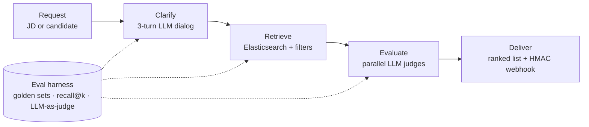

# LLM matching & evals for a Japanese recruiting platform

**Role:** built the whole matching workflow (Oct 2025 – present), after building the first vector-DB + re-ranker search; a teammate owned the CV parser · **My footprint:** 253 commits, 128 PRs

## Problem
A large Japanese recruiting database wanted recruiters to type a job description (or pick a candidate) and get a ranked shortlist with reasons, in English and Japanese, fast enough to use live.

## What I built

- **Service foundation:** FastAPI, Docker, Caddy/TLS, GitHub Actions → GHCR → staging and prod deploys, Slack alerts.
- **Retrieval:** Elasticsearch (kuromoji for Japanese) with wage/currency, language, age, experience and excluded-company filters, routed per tenant.
- **Interactive pre-screening (two flows):** the LLM asks clarifying questions and a deal-breaker question, classifies answers in parallel, then runs retrieval and parallel LLM evaluation in the background and calls back via an HMAC-signed webhook. Sessions are idempotent with status guards and TTLs.
- **Reliability:** a primary + fallback LLM provider chain hardened against malformed JSON, which removed a class of "all evaluations failed" 500/503 errors. A 4-agent robustness audit found 8 issues; all were fixed.

## Evaluation work (the part I'm proudest of)
| Finding | Result |
|---|---|
| Request filters were silently deleting 68% of the "ideal" answers in the golden set | Rebuilt a filter-aware golden set. Same model outputs: **recall@10 0.19 → 0.57** (EN), **hits@10 2.2 → 6.6** (JP) |
| Clarifying questions were often degenerate | **85% → 0%** degenerate questions, visa over-triggering **90% → 0%**, options per question **3.3 → 5.9** (72 live scenarios) |
| English leaking into Japanese sessions | **16/16 → 0/16** |
| Elasticsearch boost tuning | +6.8 pp on train, ≤1 pp on holdout: **tuning didn't generalize.** Retrieval depth was the real lever |
| LLM reranker trial | ~48k judgements for **$2.31**. My first read said +30%; I found the artifact and reported **+12.9% holdout recall@20**. Bias audit (540 probes): max Δ 0.09. ~$0.008 per search |
| Open-source reranker vs paid one | recall@20 0.153 vs 0.536 → recommended **not** switching yet |
| Token cost per session | ~20k tokens per interactive session (EN/JA, 2 providers) → client pricing page |

**Stack:** Python · FastAPI · Pydantic · Elasticsearch 8/9 · Supabase · Cerebras · OpenRouter · AWS Bedrock · Docker · Caddy · GitHub Actions · pytest
