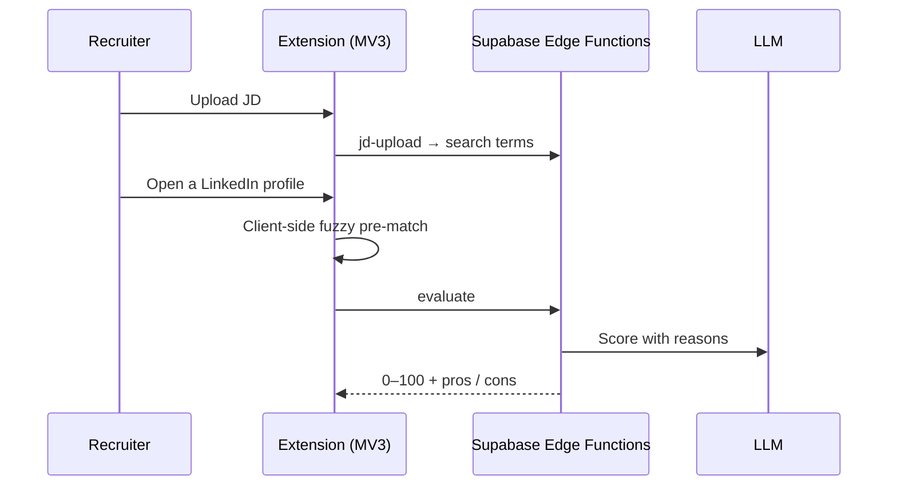

# Recruiter Copilot · AI candidate scoring on LinkedIn

**Role:** built v1, then product owner for releases 1.0.11 – 1.0.21 · **My footprint:** 121 commits

A Chrome extension (Manifest V3) for recruiters: upload a job description, browse LinkedIn, and every profile gets a 0–100 fit score with pros and cons. Distributed on the Chrome Web Store.

## How it works

## Highlights
- **Scale:** 11 Chrome Web Store releases, **400+ installs**, ~150 registered users, **847 Vitest tests** across 38 files plus Playwright against the real extension.
- **Security fixes:** a cross-account data leak through Postgres `SECURITY DEFINER` functions that bypassed RLS, and a payment round-trip that refunded the free allowance.
- **Accounts and billing:** required sign-up with email OTP, a one-time free-credit grant tied to verified usage, Dodo Payments webhooks.
- **Telemetry:** Slack error alerts with fingerprint dedup and spike thresholds, sign-up and install alerts via DB trigger → Edge Function → Slack, release-adoption alerts at 60% and 90%. One schema bug turned out to cause 32 of 75 weekly errors.
- **LinkedIn quirks:** lazy-loaded profile sections, re-scoring when content changes on scroll, a fast path for revisits.

**Stack:** JavaScript (MV3) · Supabase (Postgres, RLS, Edge Functions, pg_net) · OpenRouter · Dodo Payments · Vitest · Playwright
