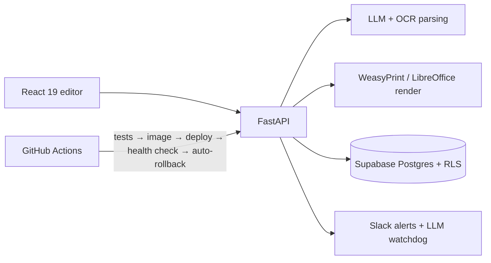

# RefineCV · B2B CV-formatting SaaS

**Role:** co-lead engineer (May – Sep 2026) · **My footprint:** 435 commits, 203 PRs authored, 188 of 213 PR merges

RefineCV turns any candidate CV (PDF, DOCX, scans) into an agency-branded document using LLM parsing, OCR and configurable templates, with teams, credits and billing. It's sold to recruitment agencies.

## Architecture

## Highlights
- **Security:** found and fixed an authorization bug class where the API trusted a caller-supplied tenant ID at **63 call sites**. The tenant is now derived server-side from membership. Also revoked direct browser writes to billing tables, fixed owner-only RLS policies, hardened JWT/CORS/headers, and ran a pen-test style review with a numbered findings report.
- **Performance:** intermittent production 500s turned out to be **async event-loop starvation** from synchronous PDF rendering. Moved rendering to a serialized executor across all 5 call sites.
- **Observability:** an LLM-provider watchdog (`/health/llm` + Slack) that discovered the production fallback model had been silently dead.
- **Quality gates:** a parsing-faithfulness scorecard on every deploy, Playwright E2E (12 staging / 10 production smoke flows), and a manual QA run system (checklist → run sheet → Supabase + screenshots → Slack).
- **AI assistant:** chose the CV-editing assistant's model with a **24-model × 61-scenario bake-off (3,162 live turns)**: 0.982 vs the incumbent's 0.907.
- **Product:** on-canvas WYSIWYG editing with rich text, CV import, cover pages, onboarding tour, OTP password reset, credit and billing fixes.

**Stack:** FastAPI · WeasyPrint · Jinja2 · React 19 · TypeScript · Vite · Zustand · TanStack Query · Tailwind · Astro · Supabase · Docker · Caddy · Cloudflare · GitHub Actions · Playwright · pytest
